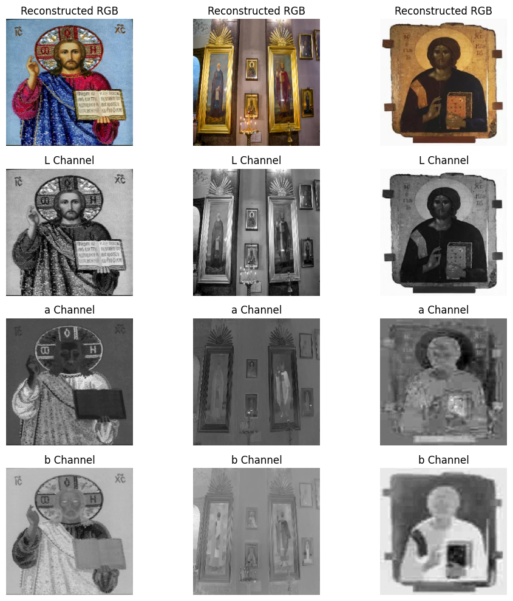
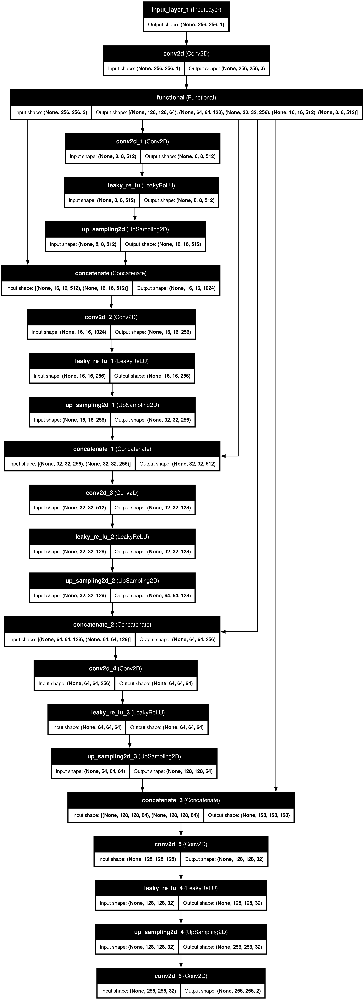
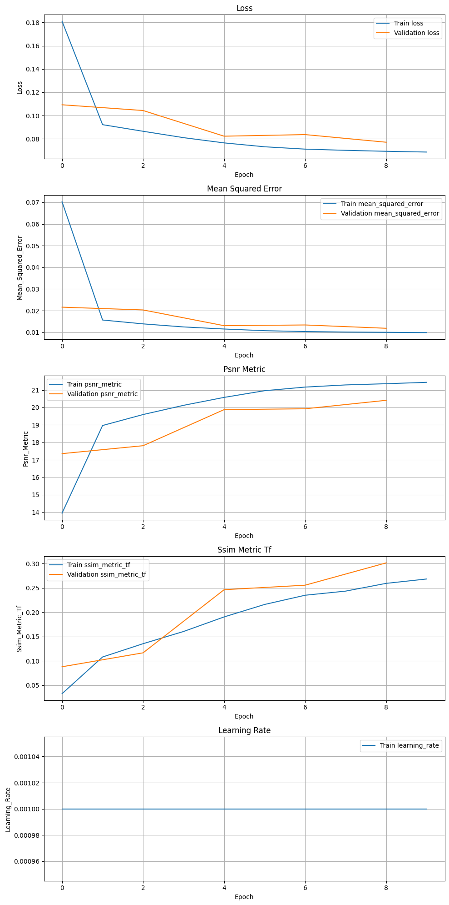
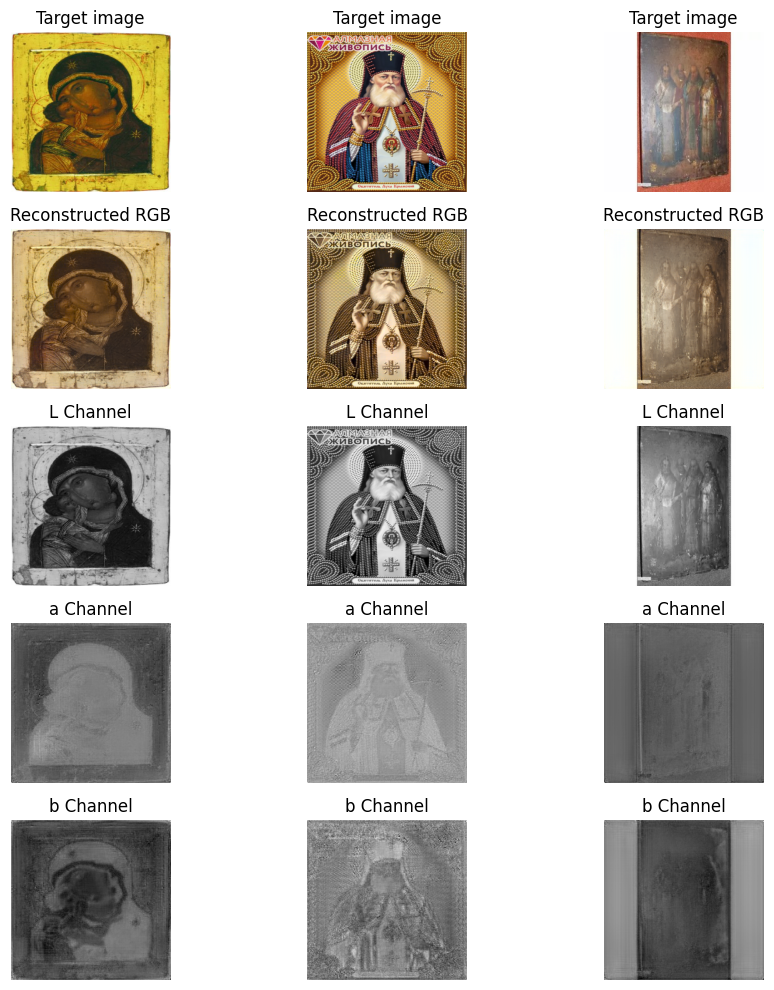

# Project 3

## Data

Used datasets:

- <https://www.kaggle.com/datasets/thedownhill/art-images-drawings-painting-sculpture-engraving/data> - Iconography (old Russian art)

- <https://zenodo.org/records/4737435> - extension to provide some data diversity



---

DVC: <https://drive.google.com/drive/folders/1oRFn162Gr6p4XP7dyCRv6fbLlnSMzdp9?usp=drive_link>

---

Model: <https://drive.google.com/drive/folders/17N6gRhxTbnh1tScnuSh6dy_HTS_6-R_j?usp=drive_link>

## Problem

Problem:

- Iconography colorization using neural networks

---

### General concept of neural network

- U-net-inspired network with VGG16



### Materials

- <https://github.com/mberkay0/image-colorization>
- <https://medium.com/@geokam/building-an-image-colorization-neural-network-part-4-implementation-7e8bb74616c>
- lecture/lab presentations

### How to run

Load requirements

```bash
python3.11 -m pip install -r req.txt
```

```bash
TF_CPP_MIN_LOG_LEVEL=3 python3.11 colorize.py colorizer_n.keras <input_image>
<output_imagee>
```

### Training metrics



### Predictions

